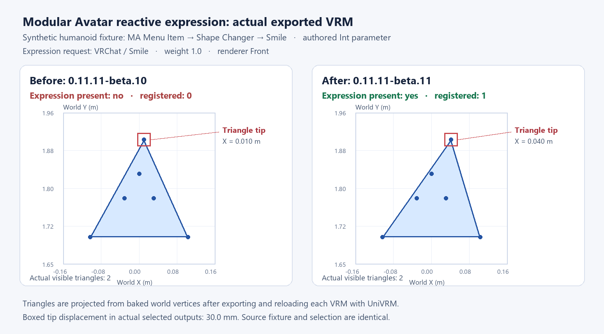

# MA reactive expression output comparison

The left output uses main `251057c5940b6fe720815ca9119854d040a5de32`
(`0.11.11-beta.10`); the right output uses the production code in this PR
(`0.11.11-beta.11`). Both run the same public synthetic humanoid fixture,
MA Menu Item / Shape Changer, authored Int parameter, neutral Smile weight 25,
and selected expression weight 1.0. No private avatar or camera image is used.

The image renders actual baked world vertices and triangles after exporting and
reloading each VRM with UniVRM. The red boxes show the selected triangle tip:
main has no registered expression and stays at X=0.010 m; this PR registers the
expression and reaches X=0.040 m. The JSON files contain the captured off/on
geometry and actual expression presence, without machine paths or editor logs.

Reproduction: `MaReactiveExpressionExportTests.MenuReactiveShapeSurvivesCanonicalBuildAndVrmReload(False,Int)`.
Set `VRVLOG_REACTIVE_EVIDENCE_DIR` to a local output directory before running the
real Unity `exporter-integration` profile. Int, Bool and Float variants, with and
without permanent geometry deletion, also check exact geometry, binary selection
and return to neutral. The MA suite also compares direct Merge Motion clips and
nested BlendTrees against the canonical build without appearance freezing,
using absolute, implicit relative and explicit relative binding roots. All 15
MA regressions fail on the specified main; all 15 pass with this PR.
The direct FX discovery suite covers 111 cases, including parameter-driver
and Animator-curve relays, preceding state gates for nested machines, and user
controls inside runtime/generated parent trees without overriding those parents.
Nested Exit paths retain entry, source-state and parent transition conditions,
including recursive exits. Native Animator evaluation also verifies blocked
AnyState paths; cyclic or excessively deep optional paths retain diagnostics.
Conditional Entry fallthrough and sibling priority retain logically negated
comparisons, including exact and adjacent Float boundaries. Default warm-up
selections and empty SDK layer-control states also preserve the complete face.
Their original-controller oracles verify state reachability and stable geometry;
SDK Set/weight goals are independently applied where Unity alone has no client
delegate. Malformed direct Entry-to-Exit metadata is diagnosed before playback.
BlendTree inputs must have declared Float parameters, including readonly and
nested controls; missing or incompatible declarations retain an optional
diagnostic without publishing false selections or discarding authored entries.
Six additional state-path cases use original native Animator playback to check
renamed layer roots, nested paths and synced source roots, while preserving the
existing unsupported-sync diagnostic and rejecting a different candidate state.

Environment: Unity 2022.3.22f1, UniGLTF/UniVRM 0.131.0, lilToon 2.3.4,
Modular Avatar 1.18.7, NDMF 1.14.8, VRChat SDK 3.10.5,
MeshDeleterWithTexture 0.10.5, and Avatar Optimizer 1.9.20 with the repository's
explicit `vrvlog.aao-1.9.20.vertex-buffer-dispose.1` correction in an isolated
validation copy. This evidence covers synthetic fixtures, not every avatar.
