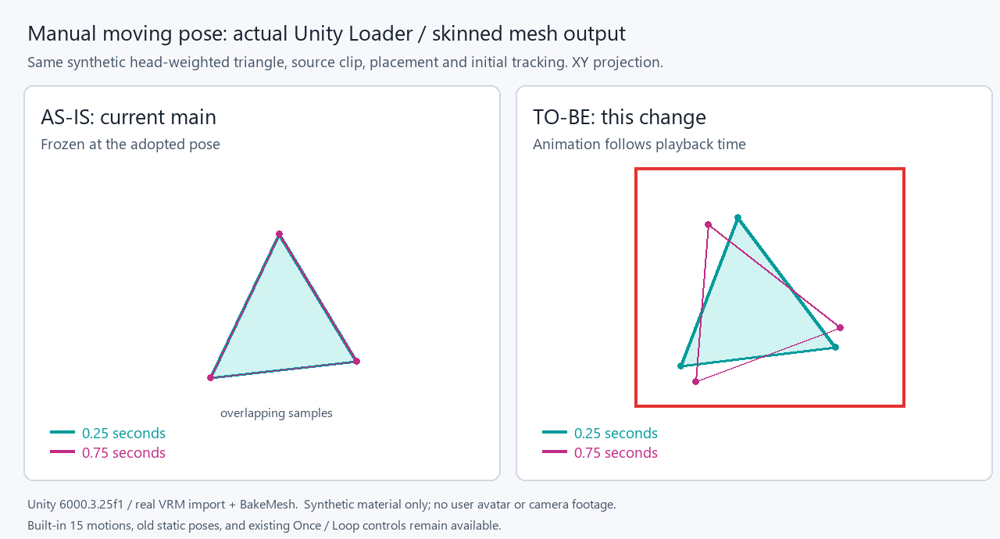

# Manual moving pose output comparison

Left: exporter main `8afc381c611bf52d91d0a49102a78b80f9645f84` and application
main `a8344848432cf6a6bae4dc7f8560f70ab3eb08d5`. Right: the new exporter and
application implementation. The subsequent app main `bbcfe9b1` changes CI,
host tests and documentation only; its Assets rendering/playback sources are
unchanged from this baseline.

Both use the same first-party synthetic Humanoid skeleton, three-vertex triangle
weighted entirely to Head, manual clip input, placement, initial head tracking,
and playback times 0.25/0.75 seconds. The image projects actual `BakeMesh` world
vertices onto XY; it does not simulate the result. The baseline actually exports
the moving clip as a time-zero static pose and remains unchanged. The candidate
exports an animation and the imported skin moves. The red box marks that output.
No user avatar, private diagnosis, or camera footage is included.

`baseline.json` contains the complete public source curves and native output;
`candidate.json` contains the actual new Loader output. The baseline producer and
consumer each passed their independent real Unity test. The new producer's
`AnimatedManualPoseExportTests.ActualVrmExportAndReimportRetainsBoundAnimationFramesAndStaticCompatibility`
writes the fixture with `VRVLOG_ANIMATION_FIXTURE`; the app's
`EmbeddedHumanoidAnimationTests` loads it through the production Loader and can
emit skin samples with `VRVLOG_ANIMATION_CONSUMER_EVIDENCE`.

The focused exporter pose suites passed 131/131 (25 moving, 42 legacy pose,
4 review-window, 60 registration cases). Application standard/static/moving,
head ownership, placement and grounding suites passed 104/104. Both had zero
failures and skips. The shared standalone pose/animation contract passed 91
assertions. These are Unity Editor and host results, not device or player build
verification.

Producer: Unity 2022.3.22f1, UniVRM 0.131.0, lilToon 2.3.4, MA 1.18.7,
NDMF 1.14.8, VRChat SDK 3.10.5, official Avatar Pose Library 1.2.44, and the
existing isolated AAO 1.9.20 correction. Consumer: Unity 6000.3.25f1 / URP 17.3.0.
First-party fixture SHA-256:
`546362b9ef809c0ea56f2a07cd47c59cc23f2d71bf5f55bef7b813f12c9f8fe7`.

Using these motions requires the matching application update. Earlier apps
ignore the optional animation extension, retaining ordinary VRM/static/builtin
behavior. Re-export the original avatar after updating the exporter.
