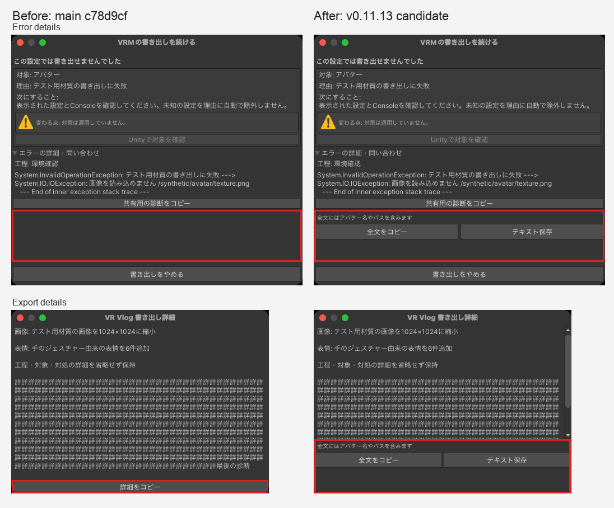

# Export error full text: native Editor UI evidence

The comparison was captured from Unity 2022.3.62f3 on a physical Mac running macOS 27.0.1. Both sides use the same isolated project, fixtures, Editor theme and minimum window sizes (failure: 520 × 420; normal details: 460 × 300). The fixture uses a synthetic nested exception and deliberately long synthetic details; it contains no user avatar, camera footage or personal path.

Left: current main `c78d9cf8a04098f6a461b1a1326958312db607aa`. Right: this PR's 0.11.13 source. The pictures are native window captures, composed without changing their pixels. Red outlines mark the changed footer areas. macOS window chrome adds 28 pixels to each captured height.

Visual QA also covered Japanese, English, Korean, Simplified Chinese and Traditional Chinese at these sizes. The full-text and save controls remain outside the long scrollable report. Copy/save feedback has a fixed-height scrollable area so it does not move the controls. The existing redacted support-copy action remains available separately.

Eight native Editor regression cases cover every diagnostic field across 120 large diagnostics, exact nested exception/stack text, an 180,000-character Unicode clipboard and byte-identical UTF-8 file, cancellation, replacement, write failures, temporary-file cleanup, and the retained full diagnostic snapshot after Editor serialization. The existing `exporter-behavior` validation profile requires all eight named cases.
